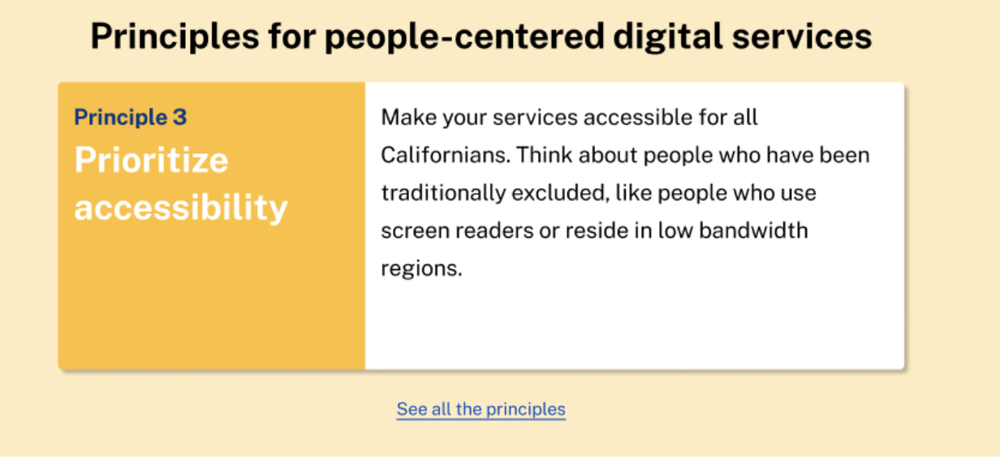

# Highlight section component

## Description:

Highlight section is a great way to showcase small bits of important information, and can be used to display services or features. 

## When and how to use it:

Use this to catch attention and highlight the top tasks or business priorities. 

## Structure:

Highlight section component consist of three parts: header with the main title, the body, and the footer. The body consists of two halves. First half contains concise a secondary title, and a subtitle, The second one has text description. The footer contains a call-to-action link. 

## Features:

Component is also incorporates full bleed background. 


## Screenshot


## HTML

```
        <cagov-highlight-section>
          <article role="article" class="full-bleed bg-highlight-lightest">
            <div class="container">
              <header class="highlight-header">
                <h2>Principles for people-centered digital services</h2>
              </header>
              <section class="highlight-body">
                <div class="highlight-image bg-primary-lightest">
                  
                </div>
                <div class="highlight-text">
                  <h3>Prioritize accessibility</h3>
                  <h4 class="mt-0">Principle 3</h4>
                  <p>Make your services accessible for all Californians. Think about people who have been traditionally excluded, like people who use screen readers or reside in low bandwidth regions.</p>
                  <div class="wp-button">
                    <a class="btn-primary-outline">See all the principles</a>
                  </div>
                </div>
              </section>
            </div>
          </article>
        </cagov-highlight-section>
```

### Expected variables

There are some colors that should be defined by the containing page.

Expected definition is:

```
:root {
  --white: #ffffff;
  --primary-100: #b3c9eb;
  --primary-700: #165ac2;
  --primary-900: #003588;
  --accent2-100: #ffecc1;
  --accent2-500: #ac8226;
  --w-lg: 1176px;
  --s-1: 0.5rem;
  --s-2: 1rem;
  --s-2: 1rem;
  --s-3: 1.5rem;
  --s-4: 2rem;
  --font-size-2: 1.125rem;
  --font-weight-6: 600;
  --font-lineheight-3: 1.5;
  --border-1: 1px;
  --border-2: 2px;
  --radius-2: 4px;

}
```

## Contributor/developer documentation

- [Component information](https://github.com/cagov/design-system/blob/main/components/README.md)

- [Component README template](https://www.notion.so/odi-engineering/Component-documentation-template-2da3975cc0954174ace43004d151451c)

- [Unit tests](https://github.com/cagov/design-system/blob/main/components/UNIT-TESTS.md)
