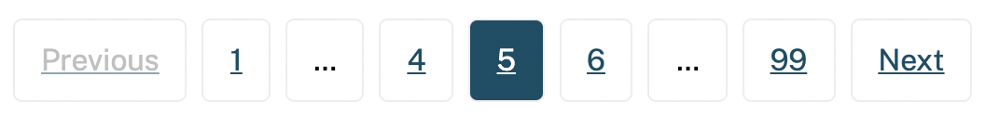

# Pagination

This custom element renders a set of links to page through sets of items.

It accepts attributes for the number of pages and current page. These are watched for changes and the component re-renders if these attributes change

```
data-current-page="5"
data-total-pages="99"
```

It also accepts optional strings for all the text so it can be used in multiple languages:

```
data-previous="Previous"
data-next="Next"
data-page="Page"
```

The component triggers custom events on page clicks. Subscribe to events on this element to watch for clicks. The following event format is sent on click:

```
new CustomEvent("paginationClick", {
  detail: this.currentPage - 1,
})
```




## Sample markup

```
<cagov-pagination data-current-page="5" data-total-pages="99"></cagov-pagination>
```


## Docs

Run: ```npm run start``` at the repository root to preview elements. This will launch local server with links to component demo pages.

The documentation is generated using the <a href="https://github.com/webcomponents/custom-elements-manifest">custom elements manifest schema</a> draft standard <a href="https://github.com/runem/web-component-analyzer">analyzer</a> command. Here is an example run outside the accordion directory:

```
wca analyze src --format json --outFile custom-elements.json
```

Then the <a href="https://github.com/web-padawan/api-viewer-element">api viewer element</a> references the generated custom-elements.json and builds a live preview playground with docs.